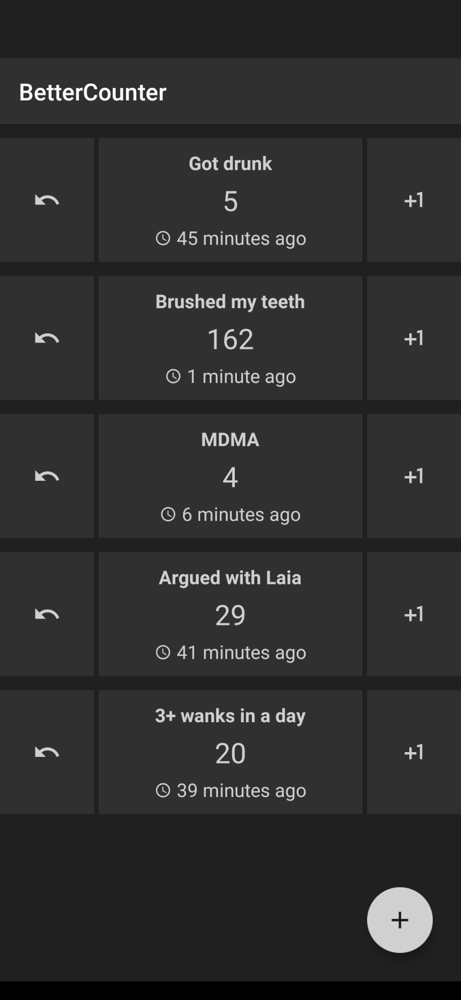

# BetterCounter

 
###  A multi-purpose counter app

- Track good and bad habits (eg: exercising, smoking, drinking...)
- Track when's the last time you did something (eg: water your plants, change your bedsheets, poop...)
- Count your lives in MtG

###  Get it now!

- From [F-Droid](https://f-droid.org/vi/packages/org.kde.bettercounter/)
- From the [Play Store](https://play.google.com/store/apps/details?id=org.kde.bettercounter)

### Features

- Records the date and time of each individual counter increase.
- Graphs your data over time and calculates statistics.
- Lets you export your data (eg: to analyze it with your choice of tools).
- Your data is never sent to any server (except for Google's app backup, if enabled).
- Simple as hell and will stay this way.

### Screens

